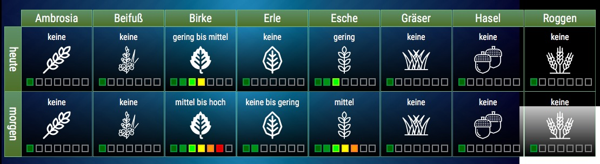
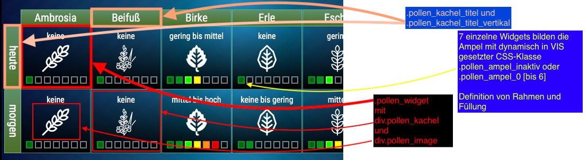

# VIS Darstellung für ioBroker Pollenflug Adapter

## VIS Widget
Code zum Importieren im VIS Editor in der Datei ``widget`` 

## CSS
CSS Code zum Kopieren in den Reiter CSS/Projekt des VIS-Editors in der Datei ``CSS``

## History
### 0.0.1 initial (06.04.2019)
Stand: https://forum.iobroker.net/post/250505
+ Farben zentral über CSS steuerbar
+ CSS-Validität optimiert

Copyright: Pix 2019
MIT Licence
